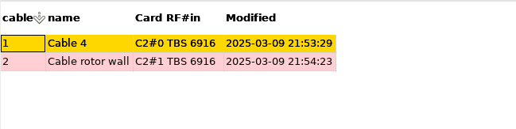

# neumoDVB #

## The cable list ##

the cable list is an advanced feature. It is mainly useful for users that frequently reconfigure their equipment,
e.g., switching between cards to test these cards. It allows quickly moving LNB configurations from one card to another.

With `cable` we mean the cable that is connected to one of the RF inputs of a card. A cable typically connects
to a DiSEqC switch, which is possibly cascaded other DiSEqC switches and thus can be connected to multiple LNBs.

Using the `cable list` it is possible to rewire a cable to another RF input on the same or another card. neumoDVB will
then adjust all LNB connections to reflect the new situation.

The fields heave the following meaning

* `cable`. An automatically assigned id that is created when a new record is entered.

  default dish can be used for any LNB not on a positioner;
* `name`.  **Editable**  A name assigned to this cable.

* `Card RF#in` **Editable**   The specific RF input on a specific card the cable is connected to.

* `Modified` The date and time when the cable (e.g., name or card RD #in) was last changed.
